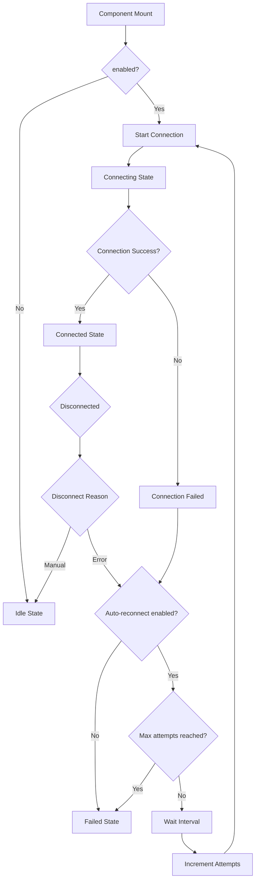

# Auto Subscription Enhancement Architecture Plan

## Overview

This document outlines the architectural changes needed to enhance the `useAutoSubscription` hook with:
1. Replace `skip` parameter with `enabled` parameter
2. Add automatic reconnection functionality with configurable intervals
3. Support both global and per-subscription reconnection settings

## Analysis Summary

### Current State
- `skip` parameter exists in both `useQuery` and `useAutoSubscription` hooks
- No current usage of `skip` parameter found in the codebase (safe to replace)
- WebSocket connections close on any error without reconnection attempts
- Manual reconnection is available via `reconnect()` function

### Migration Impact
- **No Risk**: `useAutoSubscription` has not been released yet, so breaking changes are safe
- **No Changes to useQuery**: `useQuery` is already released and should remain unchanged
- Only `useAutoSubscription` will be modified to use `enabled` instead of `skip`

## Detailed Design

### 1. Reconnection Configuration Interfaces

#### Global Configuration (IGraphQLConfiguration)
```typescript
interface ISubscriptionConfig {
  /** Whether auto-reconnection is enabled by default */
  enabled?: boolean;
  /** Reconnection interval in milliseconds (default: 5000) */
  interval?: number;
  /** Maximum number of reconnection attempts (0 = unlimited, default: 0) */
  maxAttempts?: number;
}

// Add to IGraphQLConfiguration
interface IGraphQLConfiguration {
  // ... existing properties
  /** Default settings for subscriptions including reconnection behavior */
  subscriptionDefaults?: ISubscriptionConfig;
}
```

#### Per-Subscription Configuration
```typescript
interface IUseAutoSubscriptionOptions<TResult, TVariables> {
  // ... existing properties except skip
  /** Whether the subscription is enabled (replaces skip) */
  enabled?: boolean;
  /** Reconnection configuration for this subscription */
  reconnection?: ISubscriptionConfig | boolean; // boolean for simple enable/disable
}
```

### 2. Enhanced Return Interface

```tsx
type ConnectionStatus =
  | 'idle'           // Not started (enabled=false)
  | 'connecting'     // Initial connection attempt
  | 'connected'      // Successfully connected
  | 'reconnecting'   // Actively attempting to reconnect
  | 'waiting'        // Waiting for next reconnection attempt (during interval delay)
  | 'disconnected'   // Failed/disconnected, not attempting reconnection
  | 'failed';        // Max reconnection attempts reached

interface IUseAutoSubscriptionRet<TResult> {
  // Simple API - for basic use cases
  /** Whether the subscription is currently connected */
  connected: boolean;
  /** Whether the subscription is currently connecting (includes reconnecting) */
  connecting: boolean;
  
  // Advanced API - for complex use cases
  /** Detailed connection status */
  status: ConnectionStatus;
  /** Number of reconnection attempts made */
  reconnectionAttempts: number;
  
  // Controls
  /** A function to manually abort the subscription */
  abort: () => void;
  /** A function to manually reconnect the subscription */
  reconnect: () => void;
}
```

**Boolean Property Logic:**
- `connected = status === 'connected'`
- `connecting = status === 'connecting' || status === 'reconnecting' || status === 'waiting'`

### 3. Use Case Examples

**Simple Use Case:**
```tsx
const BasicChat = ({ roomId }: { roomId: string }) => {
  const { connected, connecting, reconnect } = useAutoSubscription(
    CHAT_MESSAGES_SUBSCRIPTION,
    { variables: { roomId } }
  );

  return (
    <div>
      {!connected && connecting && <div>Connecting...</div>}
      {!connected && !connecting && <button onClick={reconnect}>Reconnect</button>}
      <ChatMessages />
    </div>
  );
};
```

**Complex Use Case:**
```tsx
const AdvancedChat = ({ roomId }: { roomId: string }) => {
  const { status, reconnectionAttempts, reconnect } = useAutoSubscription(
    CHAT_MESSAGES_SUBSCRIPTION,
    { variables: { roomId } }
  );

  const getStatusMessage = () => {
    switch (status) {
      case 'connecting': return "Connecting to chat...";
      case 'reconnecting': return `Reconnecting... (attempt ${reconnectionAttempts})`;
      case 'waiting': return `Connection lost, retrying... (attempt ${reconnectionAttempts})`;
      case 'disconnected': return "Chat disconnected";
      case 'failed': return "Connection failed after multiple attempts";
      default: return null;
    }
  };

  const showRetryButton = status === 'disconnected' || status === 'failed';

  return (
    <div>
      <div className="status-bar">{getStatusMessage()}</div>
      {showRetryButton && <button onClick={reconnect}>Retry Connection</button>}
      <ChatMessages />
    </div>
  );
};
```

**Stock Price Dashboard:**
```tsx
const StockPrice = ({ symbol }: { symbol: string }) => {
  const { connected, connecting } = useAutoSubscription(
    STOCK_PRICE_SUBSCRIPTION,
    { variables: { symbol } }
  );

  const connectionStatus = connected ? 'live' : connecting ? 'connecting' : 'stale';
  
  return (
    <div className="stock-widget">
      <span className={`status-indicator ${connectionStatus}`}>
        {connectionStatus === 'live' && '🟢 Live'}
        {connectionStatus === 'connecting' && '🟡 Connecting'}
        {connectionStatus === 'stale' && '🔴 Stale'}
      </span>
      <StockData />
    </div>
  );
};
```

**Notification System with Custom Reconnection:**
```tsx
const NotificationSystem = () => {
  const { status, reconnectionAttempts } = useAutoSubscription(
    NOTIFICATIONS_SUBSCRIPTION,
    {
      reconnection: {
        enabled: true,
        interval: 10000, // 10 seconds
        maxAttempts: 3
      }
    }
  );

  useEffect(() => {
    if (status === 'failed') {
      showSystemError("Connection lost. Please refresh to retry.");
    }
  }, [status]);

  return (
    <div className="notification-panel">
      {status === 'reconnecting' && (
        <div className="reconnecting-banner">
          Reconnecting to notifications... (attempt {reconnectionAttempts})
        </div>
      )}
    </div>
  );
};
```

### 4. GraphQLClient Enhancement

#### Modified ExecuteSubscription Return Type
```typescript
interface ISubscriptionResult {
  connected: Promise<void>;
  abort: (reason?: 'manual' | 'error') => void; // Enhanced to indicate abort reason
}
```

#### Implementation Changes
- Modify `ExecuteSubscription` to accept abort reason
- Distinguish between manual abort and unexpected disconnection
- Pass disconnection reason to `onClose` callback

### 4. Reconnection State Management

#### State Structure
```typescript
interface IReconnectionState {
  enabled: boolean;
  interval: number;
  maxAttempts: number;
  currentAttempts: number;
  timeoutId: NodeJS.Timeout | null;
  lastDisconnectReason: 'manual' | 'error' | null;
}
```

#### State Management Logic
- Track reconnection attempts and current timeout
- Reset attempts on successful connection
- Respect maxAttempts limit (0 = unlimited)
- Clear timeouts on component unmount or manual abort

### 5. Configuration Merging Logic

```typescript
const mergeSubscriptionConfig = (
  subscriptionDefaults: ISubscriptionConfig | undefined,
  local: ISubscriptionConfig | boolean | undefined
): ISubscriptionConfig => {
  const defaults: ISubscriptionConfig = {
    enabled: true,
    interval: 5000,
    maxAttempts: 0
  };
  
  const globalConfig = { ...defaults, ...subscriptionDefaults };
  
  if (typeof local === 'boolean') {
    return { ...globalConfig, enabled: local };
  }
  
  return { ...globalConfig, ...local };
};
```

## Implementation Flow

### 1. Connection Lifecycle


### 2. State Transitions
- **Idle**: `enabled=false` or manually aborted
- **Connecting**: Initial connection attempt
- **Connected**: Successfully connected and receiving data
- **Reconnecting**: Attempting to reconnect after unexpected disconnection
- **Failed**: Max reconnection attempts reached or reconnection disabled

### 3. Cleanup Strategy
- Clear reconnection timeouts on component unmount
- Clear timeouts when manually aborting
- Reset reconnection state when `enabled` changes to false
- Proper cleanup of WebSocket connections

## Breaking Changes

### API Changes (useAutoSubscription only)
1. **Removed**: `skip?: boolean` parameter
2. **Added**: `enabled?: boolean` parameter (default: `true`)
3. **Added**: `reconnection?: ISubscriptionConfig | boolean` parameter
4. **Enhanced**: Return interface with reconnection status and manual reconnect control

### Migration Path
Since `useAutoSubscription` has not been released yet, no migration is needed for existing applications.

**Note**: `useQuery` will remain unchanged and continue to use the `skip` parameter for backward compatibility.

## Testing Strategy

### Unit Tests
1. **Configuration merging**: Test global + local config combinations
2. **State management**: Test state transitions and cleanup
3. **Reconnection logic**: Test interval timing and attempt limits
4. **API compatibility**: Test new `enabled` parameter behavior

### Integration Tests
1. **WebSocket scenarios**: Test unexpected disconnections
2. **Reconnection behavior**: Test automatic reconnection attempts
3. **Manual controls**: Test abort and reconnect functions
4. **Component lifecycle**: Test mount/unmount cleanup

### Test Scenarios
- Successful connection and data flow
- Network disconnection and auto-reconnection
- Manual abort during reconnection attempts
- Max attempts reached behavior
- Configuration override scenarios
- Component unmount during reconnection

## Performance Considerations

### Memory Management
- Proper cleanup of timeouts and intervals
- Avoid memory leaks from abandoned reconnection attempts
- Efficient state updates to prevent unnecessary re-renders

### Network Efficiency
- Respect reconnection intervals to avoid overwhelming server
- Exponential backoff could be added in future iterations
- Proper WebSocket connection reuse

## Future Enhancements

### Potential Improvements
1. **Exponential backoff**: More sophisticated retry strategy
2. **Connection health monitoring**: Ping/pong heartbeat
3. **Reconnection events**: Callbacks for reconnection lifecycle events
4. **Jitter**: Random delay to prevent thundering herd
5. **Connection pooling**: Reuse connections for multiple subscriptions

### Backward Compatibility
- **useAutoSubscription**: No backward compatibility needed (not yet released)
- **useQuery**: No changes required (maintains existing `skip` parameter)
- Different parameter names between hooks is acceptable for their respective use cases

## Implementation Priority

### Phase 1: Core Changes
1. Update interfaces and types
2. Implement basic reconnection logic
3. Replace `skip` with `enabled`

### Phase 2: Enhanced Features
1. Add reconnection state management
2. Implement configuration merging
3. Add manual reconnect function

### Phase 3: Testing & Documentation
1. Comprehensive test suite
2. Update documentation
3. Migration guide

This architecture provides a robust foundation for automatic reconnection while maintaining clean APIs and proper resource management.